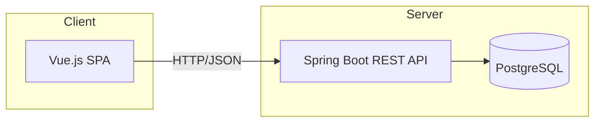

# 💈 Aplicación Web para la Gestión de Barberías (Spring + Vue + PostgreSQL)

Aplicación full-stack para gestionar reservas, clientes y servicios en barberías, con paneles diferenciados para **cliente**, **barbero** y **administrador**. Moderniza la operativa del negocio y mejora la experiencia del usuario con reservas online, notificaciones y valoraciones.

> 📄 **Memoria del TFG (UDC):** http://hdl.handle.net/2183/41551

---

## 🚧 Estado del proyecto

Actualmente el **código está completo y en GitHub** ✅.  
El **despliegue en un entorno online ** está en proceso y pronto se añadirá aquí la URL de demo para poder probar la aplicación directamente.


---

## ✨ Características clave

**Para clientes**
- Reserva de citas online con selección de servicios.
- Perfil e historial de citas.
- **Recomendación de cortes** en función de la forma del rostro.
- Valoraciones y comentarios tras el servicio.
- Notificaciones recordatorio de cita.

**Para barberos**
- Agenda y gestión de disponibilidad.
- Historial de clientes y servicios realizados.
- Perfil profesional (especialidades, horarios).
- Notificaciones de nuevas reservas/cambios.

**Para administradores**
- Gestión de catálogo de servicios y precios.
- Gestión de usuarios (clientes y barberos).
- Creación de promociones y configuración global.

---

## 🧱 Arquitectura

Stack principal:
- **Backend:** Java **Spring Boot** (API REST)
- **Frontend:** **Vue.js**
- **Base de datos:** **PostgreSQL**
- **Otros:** Maven, Node.js, Git/GitHub



## 🚀 Ejecución en local

Mientras la demo online está en proceso de despliegue, es posible ejecutar el proyecto en local siguiendo estos pasos:

### 🔑 Requisitos

- JDK 17+
- Node.js 16+
- PostgreSQL (crear base de datos `tfg`)

### 📥 Clonar el repositorio
```bash
git clone <url-del-repo>
cd tfg
```

### ⚙️ Configurar variables de entorno

Edita tus credenciales en el entorno o en un fichero `.env`.  
Ejemplo de configuración mínima:

```env
SPRING_DATASOURCE_URL=jdbc:postgresql://localhost:5432/tfg
SPRING_DATASOURCE_USERNAME=<usuario>
SPRING_DATASOURCE_PASSWORD=<contraseña>
PROPERTIES_CLIENTHOST=http://localhost:1234
APP_BASE_URL=http://localhost:8080
```

👉 Revisa la sección **Variables de entorno** para ver la lista completa.

### ▶️ Levantar el backend
```bash
cd servidor
./mvnw spring-boot:run
```

El backend quedará disponible en:  
👉 http://localhost:8080/api

### 💻 Levantar el frontend
```bash
cd cliente
npm install
npm run serve
```

El frontend quedará disponible en:  
👉 http://localhost:1234, conectado al backend.


## 🔧 Variables de entorno obligatorias

Estas variables controlan la configuración del backend. Cada una puede definirse en el entorno y tiene el valor indicado por defecto:

⚠️ **Nota:** por seguridad no se incluyen credenciales reales.  
Configura tus propias credenciales en el entorno antes de ejecutar la aplicación.

| Variable | Ejemplo |
|----------|------------------|
| `SPRING_DATASOURCE_URL` | `jdbc:postgresql://localhost:5432/tfg` |
| `SPRING_DATASOURCE_USERNAME` | `tfg` |
| `SPRING_DATASOURCE_PASSWORD` | `password` |
| `SPRING_MAIL_HOST` | `smtp.gmail.com` |
| `SPRING_MAIL_PORT` | `587` |
| `SPRING_MAIL_USERNAME` | `usuario@gmail.com` |
| `SPRING_MAIL_PASSWORD` | `contraseña_de_app` |
| `PROPERTIES_CLIENTHOST` | `http://localhost:1234` |
| `PROPERTIES_JWTSECRET` | `dev-secret` |
| `PROPERTIES_JWTVALIDITY` | `7200` |
| `PROPERTIES_UPLOAD_PATH` | `/tmp/uploads` |
| `APP_BASE_URL` | `http://localhost:8080` |

---


## 🔧 Configuración del frontend

El cliente de Vue puede apuntar a distintos backends mediante la
variable de entorno `VUE_APP_BACKEND_URL`.

- Durante el desarrollo se utiliza la URL definida en
  `.env.development`.
- Para producción se puede definir en `.env.production`.

También es posible establecer la variable manualmente antes de ejecutar
los comandos de Vue CLI:

```bash
VUE_APP_BACKEND_URL=http://localhost:8080/api npm run serve
VUE_APP_BACKEND_URL=https://backend.example.com/api npm run build
```

Estas rutas se leen en `cliente/src/constants.js`.

## 📌 Próximos pasos
- [ ] Despliegue de la aplicación en un servidor público.  
- [ ] Añadir tests end-to-end con Cypress.  
- [ ] Publicar demo accesible para cualquier usuario.  

