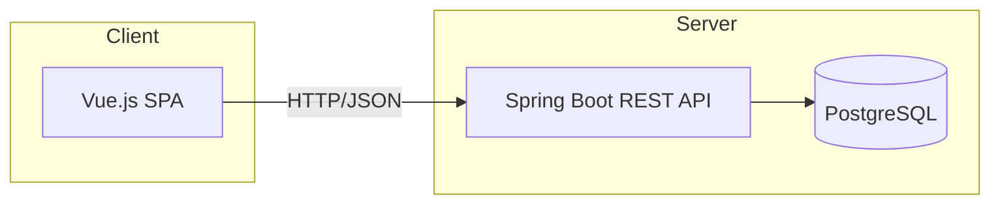

# 💈 Aplicación Web para la Gestión de Barberías (Spring + Vue + PostgreSQL)

Aplicación full-stack para gestionar reservas, clientes y servicios en barberías, con paneles diferenciados para **cliente**, **barbero** y **administrador**. Moderniza la operativa del negocio y mejora la experiencia del usuario con reservas online, notificaciones y valoraciones.

> 📄 **Memoria del TFG (UDC):** http://hdl.handle.net/2183/41551

---

## ✨ Características clave

**Para clientes**
- Reserva de citas online con selección de servicios.
- Perfil e historial de citas.
- **Recomendación de cortes** en función de la forma del rostro.
- Valoraciones y comentarios tras el servicio.
- Notificaciones recordatorio de cita.

**Para barberos**
- Agenda y gestión de disponibilidad.
- Historial de clientes y servicios realizados.
- Perfil profesional (especialidades, horarios).
- Notificaciones de nuevas reservas/cambios.

**Para administradores**
- Gestión de catálogo de servicios y precios.
- Gestión de usuarios (clientes y barberos).
- Creación de promociones y configuración global.

---

## 🧱 Arquitectura

Stack principal:
- **Backend:** Java **Spring Boot** (API REST)
- **Frontend:** **Vue.js**
- **Base de datos:** **PostgreSQL**
- **Otros:** Maven, Node.js, Git/GitHub

